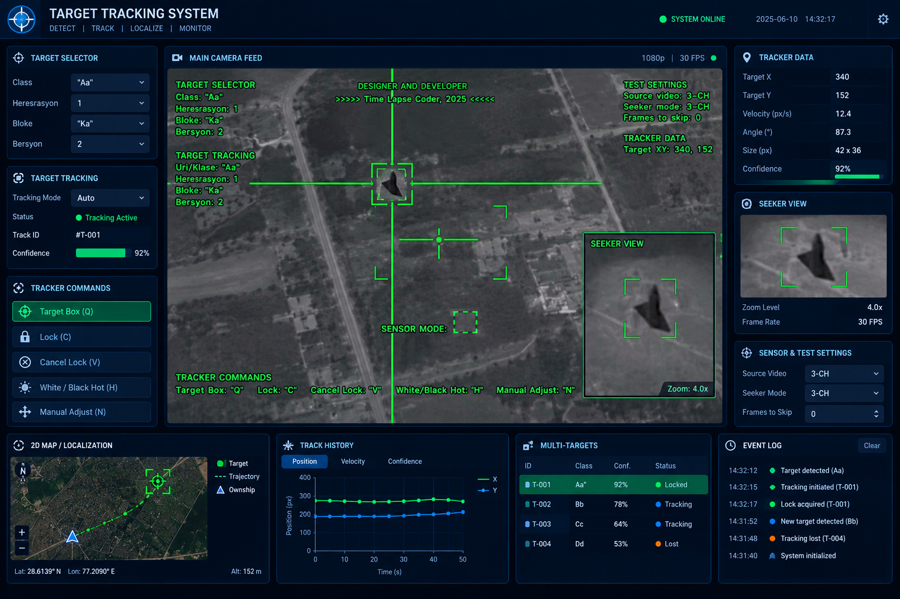

# Neon Detection Studio

A local, uploaded-image and uploaded-video **general object detection** application. The dashboard follows the supplied reference's navy background, blue panel borders, green detection overlays, central media viewer, side panels and bottom analytics row. This is the agreed detection-only adaptation, not an exact implementation of the reference's tracking modules.

**Included:** complete Python backend, HTML/CSS/JavaScript frontend, pretrained YOLOv8n COCO weights, Windows/Linux launchers, real inference tests, and setup documentation. No frontend build, Node.js, database server, paid API or CUDA GPU is required. Python packages require internet on first installation. The included model runs locally after installation.

## Windows quick start

1. Install **64-bit Python 3.11** (with the Python launcher). Python 3.13/3.14 are not supported by this pinned environment.
2. Extract this entire ZIP into a normal folder. Do not launch it from inside the ZIP.
3. Double-click **start-windows.bat**. The first installation can take several minutes.
4. Open **http://127.0.0.1:8765** in Chrome or Edge.
5. Upload an image or a short video, adjust settings, and click **Start detection**.

Manual PowerShell setup, without activation or execution-policy changes:

```powershell
py -3.11 -m venv .venv
.\.venv\Scripts\python.exe -m pip install torch==2.5.1 torchvision==0.20.1 --index-url https://download.pytorch.org/whl/cpu
.\.venv\Scripts\python.exe -m pip install -r requirements.txt
.\.venv\Scripts\python.exe server.py
```

Once dependencies are installed, only the final command is needed for subsequent runs. Stop the server with Ctrl+C. An Intel integrated GPU is fine: processing uses the CPU.

## Linux

Install Python 3.11 with its venv package, then run:

```bash
bash start-linux.sh
```

If OpenCV reports a missing `libGL.so.1`, install your distribution's `libgl1` package. To use a different port, run `.venv/bin/python server.py --port 8770`.

## Working features

| Module | Behavior |
|---|---|
| Upload | JPG/JPEG, PNG, WEBP, MP4, MOV, AVI, MKV and WEBM; 250 MB maximum |
| Inference | Bundled YOLOv8n model; confidence control; 320/640 inference size; CPU execution |
| Jobs | Single background inference worker; up to three pending uploads/jobs; progress, cancellation, error reporting |
| Media review | Processed-frame playback, frame slider, 0.5×/1×/2× speed, pause and replay |
| Overlays | Real per-frame bounding boxes, class labels and confidence values; overlay switches |
| Detection details | Class, confidence, bounding-box position and size, source-frame number |
| Crop preview | Aspect-preserving crop of the selected detection; select through the table or image |
| Analytics | Box counts over time, per-frame inference duration, processing duration, analyzed-frame count |
| History | Locally persisted sessions/results, reload after restart, explicit deletion |
| Exports | Full JSON report, detection CSV, annotated JPEG or AVI, current-view PNG snapshot |
| Event log | Upload, analysis state and error events; clear control; browser-session log |
| Layout | Responsive desktop/mobile design with no CDN dependency |

## How to use

1. Upload a file. The backend stores it locally and marks the session **uploaded**.
2. Set confidence (default 35%), frame step (default every third source frame), and inference size.
3. Start detection. During analysis, progress and counters update. The media review and downloads become available after completion or cancellation.
4. Use the slider or Play button to review analyzed frames. Click a detection row to see its details and enlarged crop.
5. Download the JSON/CSV and annotated media. Use Save current frame for a PNG matching the overlay switches.
6. Use the history row to revisit results. The × button deletes the uploaded source and all outputs for that session.

Settings apply to new analysis jobs. Upload the same file again to compare different settings.

## Accuracy and interpretation

- This is a **general COCO detector**, not a specially trained fighter-aircraft detector. It does not classify aircraft models, military affiliation, threat level or intent. Small/distant/low-light objects can be missed or mislabeled. No aircraft-specific accuracy was measured.
- Detections are independent in each sampled frame. There are no persistent track IDs, trajectories, object velocity estimates, target locks, seeker controls, geolocation, sensor fusion, live feeds or hardware commands.
- A displayed detection count is a count of bounding boxes, **not unique objects**. The same object appearing in ten frames can contribute ten boxes.
- Source images/frames are resized to fit within 1280 pixels on their longest edge. Reported pixel coordinates refer to this **analysis resolution**. JSON includes original and analysis dimensions. To map back, multiply x by `original_width / width` and y by `original_height / height`.
- Inference size (320 or 640) is the model input setting, separate from the analysis/display resolution.
- Review playback contains only sampled frames. Exported AVI uses `source_fps / stride` to preserve approximate source timing. It does not contain audio. Open AVI exports in VLC or another MJPEG-compatible player.
- Processing stops after 1,500 analyzed frames. Longer jobs are explicitly marked partial (`truncated: true`). At 30 FPS and stride 3 this covers roughly 150 seconds. Trim a long input or choose a higher stride.
- Cancellation finishes the current inference and saves available partial results. A cancelled queued job may have no exports.
- The app has no thermal sensor input. The crop preview uses the same source image and does not add detail.
- Local file headers/metadata can be invalid. Unsupported codecs produce an error; try an H.264 MP4. Corrupted videos that terminate early may yield fewer frames than container metadata predicts.

## Local storage and architecture

```text
neon-detection-studio/
  server.py              HTTP API, job worker, persistence, inference and exports
  web/index.html         Dashboard structure
  web/style.css          Responsive visual design
  web/app.js             Uploads, playback, charts and controls
  models/yolov8n.pt       Bundled pretrained general object detector
  scripts/download_model.py
  tests/test_end_to_end.py
  requirements.txt
  start-windows.bat
  start-linux.sh
  data/                  Created on first run; uploaded files and job outputs
```

The server binds only to `127.0.0.1`. Mutation requests require a per-run token. Host validation and file path checks prevent cross-origin mutations and path traversal. This is a **local research application**, not an authenticated multi-user internet service. It uses Python's standard-library HTTP server, not FastAPI. Keep it on loopback.

Jobs and results persist in `data/<job id>/`; event-log UI messages are session-only. Restarted unfinished jobs are marked interrupted and should be uploaded again. Completed results remain readable. The optional `NEON_DATA` environment variable selects a different data directory. Delete unwanted sessions to reclaim disk space; preview frames can consume substantial storage.

## API overview

- `GET /api/config` — local session token and limits
- `GET /api/jobs` — persisted session metadata
- `POST /api/upload?name=filename.mp4` — raw binary file body
- `POST /api/start` — JSON `{ "id": "...", "confidence": 0.35, "stride": 3, "size": 640 }`
- `POST /api/cancel` — JSON `{ "id": "..." }`
- `POST /api/delete` — JSON `{ "id": "..." }`
- `GET /files/<id>/results.json` — metadata and per-frame detections
- `GET /files/<id>/detections.csv` — tabular detections
- `GET /files/<id>/annotated.jpg` or `annotated.avi` — annotated output

All POST requests require the `X-Neon-Token` header returned by `/api/config`. There is no URL/video-stream ingestion or model upload endpoint.

## Verification

Run with the installed environment:

```powershell
.\.venv\Scripts\python.exe tests\test_end_to_end.py
```

The test suite runs the actual bundled model on the Ultralytics package's example street image and a short generated street video. It verifies object detections, export decoding, malformed-media errors, mutation-token validation, path traversal rejection and confidence validation. Test sessions use a temporary directory.

See `TEST_REPORT.md` for the checks executed during packaging. Linux CPU execution was tested. The Windows launcher is provided but was not executed on a Windows machine here. No accuracy benchmark on aircraft or user-supplied video is claimed.

## Model provenance and licensing

- Model: `https://github.com/ultralytics/assets/releases/download/v8.3.0/yolov8n.pt`
- Prediction API documentation: `https://docs.ultralytics.com/modes/predict/`
- Detection task documentation: `https://docs.ultralytics.com/tasks/detect/`
- Ultralytics licensing: `https://www.ultralytics.com/license`

This source package is distributed under AGPL-3.0; see `LICENSE`. The bundled Ultralytics model and package are governed by their applicable upstream licenses. Other dependencies retain their own licenses. Review upstream licensing before distributing or using the software commercially. The supplied reference image is not bundled.
